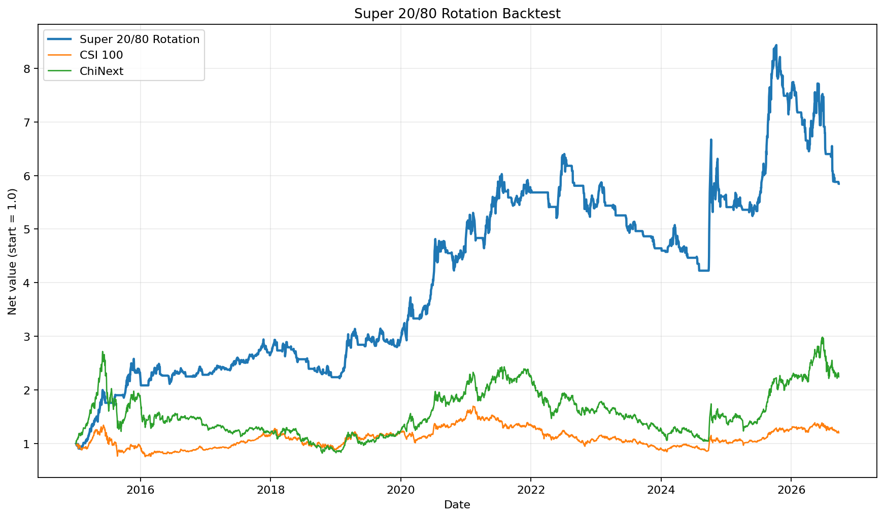

# 超级二八轮动策略回测

这是一个用 Python 实现的超级二八轮动回测。策略用中证100（`000903`）代表大盘权重风格、创业板指（`399006`）代表成长风格，比较两者近 20 个交易日的动量，在中证100、创业板指和现金之间轮动。

> 本项目仅用于历史研究，不构成投资建议。回测以指数收盘价作为可交易代理，不包含股息、ETF 跟踪误差、交易费用和滑点；因此结果不能直接视为可实现的实盘收益。

## 策略规则

每个交易日收盘后计算：

```text
momentum(t) = close(t) / close(t - 20) - 1
```

规则如下：

1. 中证100动量更高且为正：目标仓位为中证100。
2. 创业板指动量更高且为正：目标仓位为创业板指。
3. 两者动量均不满足上述条件：持有现金。
4. 当日收盘产生的信号从下一交易日开始生效，避免使用未来数据。

与旧版代码相比，新版会在另一指数转强时直接换仓，而不是等待当前持仓动量先转负；数据按日期合并，不再依赖 CSV 行号对齐。

## 2015–2026 回测结果

数据区间为 2015-01-05 至数据源当前可提供的最新共同交易日 2026-09-24，共 2,852 个交易日。参数为 20 日动量、初始资金 500,000 元、无风险利率 0%、交易成本 0。

| 指标 | 超级二八轮动 | 中证100 | 创业板指 |
| --- | ---: | ---: | ---: |
| 累计收益 | 484.51% | 20.08% | 124.54% |
| 年化收益 | 16.88% | 1.63% | 7.41% |
| 年化波动率 | 22.61% | 21.57% | 31.59% |
| 夏普比率 | 0.802 | 0.183 | 0.384 |
| 索提诺比率 | 1.238 | 0.254 | 0.554 |
| 最大回撤 | -34.00% | -50.06% | -69.74% |
| 卡玛比率 | 0.497 | 0.033 | 0.106 |

策略共发生 360 次目标仓位变化，持仓时间占比为 63.43%。完整精度指标见 `results/performance_metrics.csv`，逐年收益见 `results/annual_returns.csv`。



## 输出文件

| 文件 | 用途 |
| --- | --- |
| `csi100_index.csv` | 中证100日线，含回测前的信号预热期 |
| `chinext_index.csv` | 创业板指日线，含回测前的信号预热期 |
| `results/backtest_daily.csv` | 每日价格、动量、信号、仓位、收益和净值 |
| `results/performance_metrics.csv` | 年化收益、波动率、夏普比率、索提诺比率、最大回撤等 |
| `results/annual_returns.csv` | 策略与两条基准指数的逐年收益 |
| `results/trades.csv` | 每次目标仓位变化记录 |
| `results/super_28_rotation.png` | 净值对比图 |

原仓库的沪深300、中证500、ETF 和旧回测结果文件仍保留，便于对照，但新版策略不再读取它们。

## 安装与复现

推荐使用 Python 3.10 或更高版本：

```bash
python3 -m venv .venv
source .venv/bin/activate
python -m pip install -r requirements.txt
```

下载/更新行情：

```bash
python get_data.py --start-date 2014-11-01 --end-date 2026-09-28
```

默认通过 AkShare 获取新浪指数日线。也可以用 `--source baostock` 或 `--source eastmoney` 切换数据源。

运行回测：

```bash
python strategy.py --start-date 2015-01-01 --end-date 2026-09-28
```

常用可调参数：

```bash
python strategy.py \
  --lookback 20 \
  --risk-free-rate 0.00 \
  --transaction-cost-bps 0 \
  --initial-capital 500000
```

- `--risk-free-rate` 使用小数形式，例如 2% 填 `0.02`。
- `--transaction-cost-bps` 是每次目标仓位变化扣除的单边基点成本，例如 5 个基点填 `5`。
- 年化收益采用 252 个交易日的几何年化，波动率和夏普比率同样按 252 个交易日年化。

运行测试：

```bash
python -m unittest -v
```

## 主要假设与限制

- 回测直接使用价格指数收益，没有选择具体 ETF；这是因为中证100可交易产品无法覆盖完整的 2015–2026 区间。
- 价格指数不含分红再投资，现金收益默认为 0。
- 默认未计费用；可用 `--transaction-cost-bps` 做敏感性测试。
- 信号按收盘价生成，并延后一日生效；实际成交价格、涨跌停和流动性约束未建模。
- 2026 年年度收益是截至 2026-09-24 的年内收益，不是完整自然年收益。

## 数据来源

- 中证100、创业板指日线：AkShare 的新浪指数日线接口（默认）
- BaoStock、东方财富接口：保留为可选下载源
- 策略背景与旧版实现：仓库内 `二八轮动实现.pdf`
